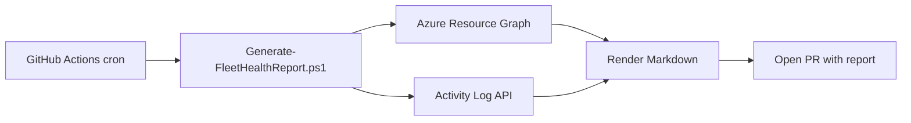

# Weekly Fleet Health Report - Spec

**Status:** final
**Owner:** j.morgan
**Last updated:** 2026-05-04

> This is a worked example to show what good looks like. Delete or replace it once the project has its own first spec.

## Problem
Operations needs a once-a-week snapshot of fleet health (Arc agent status, disk pressure, recent VM restarts) to catch slow-burn issues that don't trigger alerts. Today the team checks four dashboards manually each Monday; this is missed when on-call rotates and produces no archive.

## Goals
- One Markdown report generated every Monday at 07:00 UTC, archived under `reporting/output/YYYY-MM-DD_fleet-health_final.md`.
- Report covers all VMs in the lab subscription, grouped by resource group.
- Generation completes in under 5 minutes on the existing runner.

## Non-goals
- Real-time alerting (existing Azure Monitor alerts handle that).
- Per-VM remediation suggestions — handled by runbooks, not this report.
- HTML or PDF rendering — Markdown only for v1.
- Historical trend analysis across reports — each report is point-in-time.

## Approach
A scheduled GitHub Action (weekly cron) runs `Generate-FleetHealthReport.ps1` in the `reporting/` room. The script:

1. Queries Azure Resource Graph for VM inventory and Arc agent status.
2. Pulls the last 7 days of Activity Log entries per VM.
3. Composes a Markdown report from `reporting/templates/fleet-health.md.tmpl`.
4. Commits the rendered file to `reporting/output/` on a branch and opens a PR.

Auth uses the existing federated workload identity for the runner — no new secrets.

## Alternatives considered
| Option | Why rejected |
|--------|--------------|
| Power BI dashboard | Not a deliverable artifact; can't be diffed or archived in git. |
| Azure Workbook export | No straightforward way to schedule and commit; locks readers into the portal. |
| Logic App + email | Email isn't searchable history and bypasses the review loop. |

## Risks and mitigations
| Risk | Likelihood | Mitigation |
|------|------------|------------|
| Resource Graph query times out on large subscriptions | low | Page by resource group; cap per-page result size. |
| Activity Log returns >10k entries for noisy VMs | med | Filter to a known severity allowlist; truncate with a footer note. |
| PR queue grows if no one merges the report | med | Auto-merge after 7 days if green; alert owner if it sits longer. |

## Success criteria
- [ ] First scheduled run succeeds end-to-end against the lab subscription.
- [ ] Generated report opens cleanly in VS Code preview (no broken links).
- [ ] Median end-to-end runtime under 5 minutes across 3 consecutive runs.
- [ ] On-call confirms the report surfaces issues they'd otherwise miss.

## Open questions
_None._
